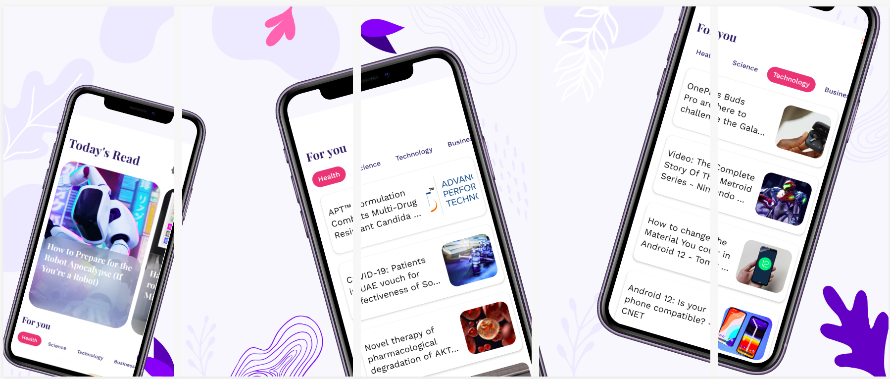

# Scoop

 
## Features
- Offline First 
- Dark Mode Support
- Explore news in diffrent category
- Intuitive UI with material design

## Tech-stack
* [100% Kotlin](https://kotlinlang.org/)  
* [Corotinues](https://kotlinlang.org/docs/reference/coroutines-overview.html) + [Flow](https://kotlinlang.org/)
* [Jetpack](https://developer.android.com/jetpack)
  * [LiveData](https://developer.android.com/topic/libraries/architecture/livedata)
  * [Lifecycle](https://developer.android.com/topic/libraries/architecture/lifecycle)
  * [ViewModel](https://developer.android.com/topic/libraries/architecture/viewmodel) 
  * [Room](https://developer.android.com/jetpack/androidx/releases/room) 
* [Retrofit](https://square.github.io/retrofit/)
* [Glide](https://github.com/bumptech/glide)
* [Moshi](https://github.com/square/moshi)
* [Hlit](https://developer.android.com/training/dependency-injection/hilt-android)
* [Store4](https://github.com/dropbox/Store) :  Kotlin Library for Async Data Loading and Caching
* [Epoxy](https://github.com/airbnb/epoxy) : Epoxy is an Android library for building complex screens in a RecyclerView
* [Material Design](https://material.io/components?platform=android)
* [blurkit](https://github.com/CameraKit/blurkit-android): Android blurring library
* [Timber](https://github.com/JakeWharton/timber)
* [FinestWebView](https://github.com/TheFinestArtist/FinestWebView-Android)

## Download
Download the latest APK [HERE](https://github.com/Abdul-Quadri-Ismail/Scoop/releases/download/v1.0/scoop.apk).

## Design Inspiration
https://dribbble.com/shots/14237842-Article-App-Customize-Your-Reading-Experience/attachments/5882288?mode=media
https://dribbble.com/shots/14607543/attachments/6299983?mode=media

## Architecture
Scoop is based on MVVM architecture 

### Learning Refrence on Store4
* [Store4](https://github.com/dropbox/Store/)
* [Article](https://medium.com/swlh/introduction-to-android-data-storage-with-dropbox-store-4-b2dc7e3753e1)

